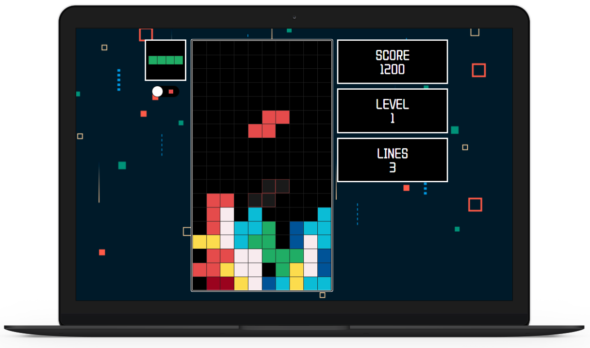
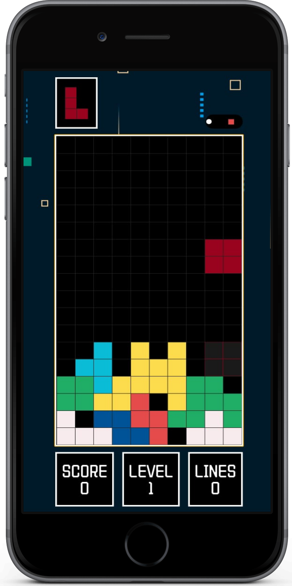
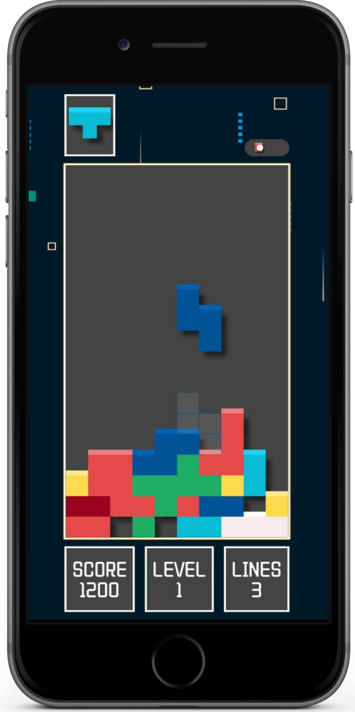

# 🚀 End-to-End DevSecOps Kubernetes Project 🌐

[](https://linkedin.com/in/abmax)
[](https://github.com/Abmaxxx)
[]()
[]()
[]()
[]()
[]()
[]()

Welcome to an end-to-end DevSecOps pipeline, built from scratch: a Tetris game, containerized, scanned, and deployed to AWS EKS — with every step from `git push` to a live public URL fully automated. 🎮🔒☁️

---

## 📂 Directories

- **`terraform/`** — Terraform scripts provisioning the AWS EKS cluster (VPC, subnets, managed node group)
- **`.github/workflows/`** — GitHub Actions CI/CD pipeline: scan, build, secure, ship
- **`manifest-files/`** — Kubernetes manifests (`deployment.yml`, `service.yml`) for the Tetris app, watched by ArgoCD
- **`tetris-v2/`** — The Tetris game itself (React), containerized with a multi-stage Dockerfile

---

## 🚀 Getting Started

**Clone the repo:**
```bash
git clone https://github.com/Abmaxxx/End-to-End-Kubernetes-DevSecOps-Tetris-Project.git
```

**Explore the pipeline:** `.github/workflows/main.yml` for CI/CD, `terraform/` for infra, `manifest-files/` for what actually runs on the cluster.

**Run it locally first:**
```bash
docker build -t tetris-v2 .
docker run -p 8080:80 tetris-v2
```

---

## 🛠️ Tools Used

| Tool | Role |
|---|---|
| **GitHub Actions** | Automated CI/CD — no Jenkins server to manage |
| **Docker** | Multi-stage build (Node → nginx), ~90% smaller final image |
| **SonarCloud** | Static code analysis & quality gate |
| **OWASP Dependency-Check** | Scans dependencies for known CVEs |
| **Trivy** | Container image vulnerability scanning |
| **Docker Hub** | Image registry |
| **Terraform** | Infrastructure as Code for the AWS EKS cluster |
| **Kubernetes (AWS EKS)** | Orchestration for the containerized app |
| **ArgoCD** | GitOps — auto-syncs manifest changes straight to the cluster |

---

## 🔁 How the Pipeline Works

```
git push → GitHub Actions
  → SonarCloud scan → OWASP Dependency-Check
  → Docker build → Trivy scan → push to Docker Hub
  → pipeline auto-commits the new image tag to deployment.yml
→ ArgoCD detects the change → auto-syncs to EKS
→ LoadBalancer → live public URL 🎮
```

No manual `kubectl apply`, no manual image tagging — push code, everything else happens on its own.

---

## 🐞 Real Problems Solved Along the Way

- Fixed CI paths after the app turned out to live at repo root, not a subfolder
- Resolved a failing SonarCloud Quality Gate by triaging flagged security issues
- Caught and cleaned up an accidental `.ssh`/`.aws` leak into a public repo (wrong `git init` location) — rotated exposure, rebuilt the repo clean with a proper `.gitignore`
- Debugged a stuck `terraform destroy` caused by an orphaned AWS Load Balancer + security group that Kubernetes created outside of Terraform's awareness

---

## 📈 Key Results

- ⚡ ~90% smaller Docker image via multi-stage builds
- 🔐 4 automated security/quality gates before any image ships
- ☸️ 2-node EKS cluster, fully provisioned as code
- 🤖 Zero manual deploy steps — full GitOps loop from push to production

---

## 🙌 Acknowledgments

Adapted from the excellent [AmanPathak-DevOps DevSecOps Tetris project](https://github.com/AmanPathak-DevOps/End-to-End-Kubernetes-DevSecOps-Tetris-Project), rebuilt with GitHub Actions in place of Jenkins and run end-to-end on a self-managed AWS EC2 + EKS setup.

## 📄 License

Licensed under Apache-2.0 — see the `LICENSE` file for details.


<!-- <h1 align="center">
  
  
  
</h1># DevSecOps---Tetris-Project -->

